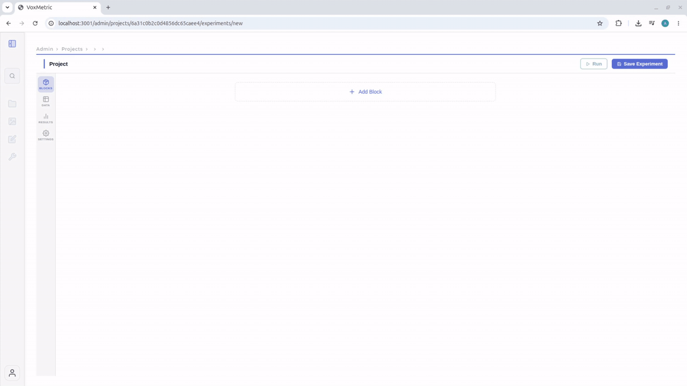

# VoxMetrix

VoxMetrix is an open-source platform for designing and running **subject listening tests** in the browser. Researchers can present audio stimuli, collect subjective ratings (e.g. MOS), track gaze during playback, and export trial-level results — all from a single web interface.

## Demo



## Features

- **Listening test experiments** — organize studies, define audio trials, and share participant links
- **Audio stimulus playback** — present speech and audio samples with controlled timing and autoplay
- **Subjective ratings** — collect MOS and other listener judgments after each trial
- **Spreadsheet editor** — map audio files, screens, and trial variables
- **Screen builder** — compose trial screens with audio players, images, rating scales, and eye tracking (WebGazer)
- **Media library** — upload and manage audio and image assets locally
- **Results export** — download participant responses, reaction times, gaze metrics, and ratings 
- **Scripts analysis** — Functions for processing exported results, quality and sensitivity analysis, as well as fixation, saccade, AOI-switch, and scanpath metrics. See [`experiments/analysis/`](experiments/analysis/) for scripts.

## Repository Structure

```text
packages/
  web/      React/Vite frontend
  server/   Express/Mongoose API
docs/
  assets/   README media (demo GIF, etc.)
experiments/
  README.md          Reproduction instructions
  *.experiment.json  Importable experiment definitions
  raw/               Anonymized raw result exports
  data/              Pseudonymized publication data
  analysis/          Public analysis scripts
docker-compose.yml
```

## Reproduce the Paper Experiments

The importable definitions, pseudonymized data, analysis scripts, and instructions
are in [`experiments/`](experiments/README.md).

## Quick Start (Docker)

Run the full local stack:

```bash
docker compose up --build
```

Then open [http://localhost:3001](http://localhost:3001). The API is at [http://localhost:8080](http://localhost:8080).

Stop the stack:

```bash
docker compose down
```

## Local Development

Install dependencies from the repository root:

```bash
npm install
```

Copy the environment template:

```bash
cp .env.example .env
```

Start MongoDB:

```bash
docker compose up -d mongo
```

Run the API and web app on the host:

```bash
npm run dev
```

The web app runs on [http://localhost:3001](http://localhost:3001). The API defaults to [http://localhost:8080](http://localhost:8080), with routes under `/api`.

Uploaded media is stored under `packages/server/data/uploads` when running the server on the host. Dockerized server uploads use the `uploads_data` volume.

### Dockerized API only

To run MongoDB and the API in Docker while developing the web app on the host:

```bash
docker compose up -d mongo server
npm run dev:web
```

## Scripts

| Command         | Description                         |
| --------------- | ----------------------------------- |
| `npm run dev`   | Start web and server in parallel    |
| `npm run build` | Build server and web for production |
| `npm run lint`  | Lint the web package                |
| `npm run test`  | Run server tests                    |

## License

This project is licensed under the GNU Affero General Public License v3.0.
See the LICENSE file for details.
